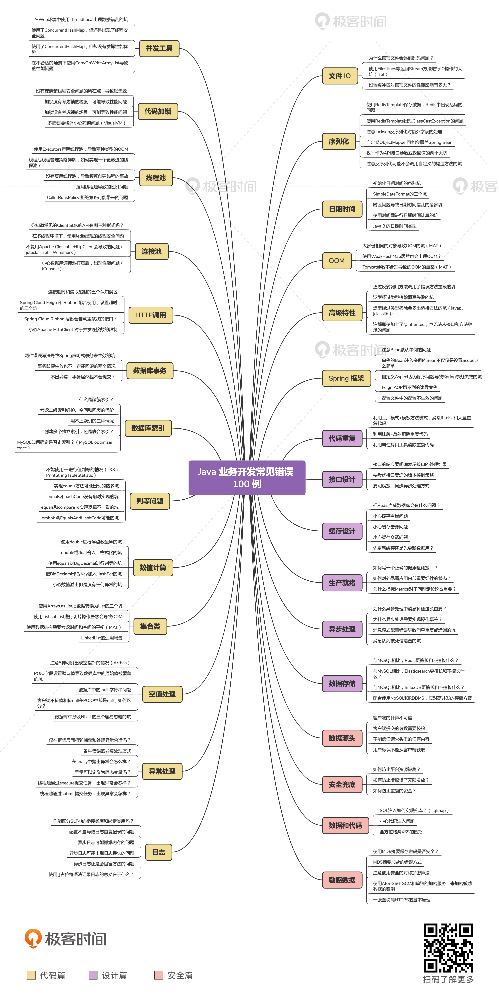

## 《Java业务开发常见错误100例》源码目录

[进入专栏](https://time.geekbang.org/column/intro/294?utm_term=zeus134KG&utm_source=blog&utm_medium=zhuye)

### 源码说明

- 专栏的所有代码基于Java 8 + Spring Boot 2.2.1.RELEASE + Spring Cloud Greenwich.SR4 + Spring Data Moore-SR4开发，基于Maven做依赖管理。
- 每一个案例都是独立的SpringBoot或Java命令行应用程序，可以单独启动，避免相互干扰，但是它们公用一个Maven POM。
- 下载源码后，先在根目录运行docker-compose up命令来通过Docker运行相关的MySQL、Redis、ES、RabbitMQ等系统，随后再来启动应用。
- 专栏大部分内容只依赖MySQL一个组件，如果docker-compose启动有困难的话可以先注释docker-compose.yml中的相关组件，比如注释ES和RabbitMQ，等后面设计篇需要用到的时候再启动，并且需要同时删除pom.xml中的相关SpringBoot Starter模块。
- 源码根目录下有一个readme.md的Markdown文件，这里有一个目录列了每一篇文章对应的源码位置，同时来到每一个源码包中下面还有一个readme.md文件，里面列了每一篇文章中每一个小节的源码包名。
- 大多数源码中的案例都会使用wrong和right这样方法命名来代表错误实现和正确实现，你可以结合文章对比实现来理解。
- 有一些案例（比如SQL索引一文）会基于当前时间生成测试数据，所以不确保文中的测试结果本地可以重现，需要自己调整测试用例。

### 代码篇

- 01 使用了并发工具类库，线程安全就高枕无忧了吗？：[concurrenttool](src/main/java/org/geekbang/time/commonmistakes/concurrenttool/)
- 02 代码加锁：不要让“锁”事成为烦心事：[lock](src/main/java/org/geekbang/time/commonmistakes/lock/)
- 03 线程池：业务代码最常用也最容易犯错的组件：[threadpool](src/main/java/org/geekbang/time/commonmistakes/threadpool/)
- 04 连接池：别让连接池帮了倒忙：[connectionpool](src/main/java/org/geekbang/time/commonmistakes/connectionpool/)
- 05 HTTP调用：你考虑到超时、重试、并发了吗？：[httpinvoke](src/main/java/org/geekbang/time/commonmistakes/httpinvoke/)
- 06 20%的业务代码的Spring声明式事务，可能都没处理正确：[transaction](src/main/java/org/geekbang/time/commonmistakes/transaction/)
- 07 数据库索引：索引不是万能药：[sqlindex](src/main/java/org/geekbang/time/commonmistakes/sqlindex/)
- 08 判等问题：程序里如何确定你就是你？：[equals](src/main/java/org/geekbang/time/commonmistakes/equals/)
- 09 数值计算：注意精度、舍入和溢出问题：[numeralcalculations](src/main/java/org/geekbang/time/commonmistakes/numeralcalculations/)
- 10 集合类：坑满地的List列表操作：[collection](src/main/java/org/geekbang/time/commonmistakes/collection/)
- 11 空值处理：分不清楚的null和恼人的空指针：[nullvalue](src/main/java/org/geekbang/time/commonmistakes/nullvalue/)
- 12 异常处理：别让自己在出问题的时候变为瞎子：[exception](src/main/java/org/geekbang/time/commonmistakes/exception/)
- 13 日志：日志记录真没你想象的那么简单：[logging](src/main/java/org/geekbang/time/commonmistakes/logging/)
- 14 文件IO：实现高效正确的文件读写并非易事：[io](src/main/java/org/geekbang/time/commonmistakes/io/)
- 15 序列化：一来一回，你还是原来的你吗？：[serialization](src/main/java/org/geekbang/time/commonmistakes/serialization/)
- 16 用好Java 8的日期时间类，少踩一些“老三样”的坑：[datetime](src/main/java/org/geekbang/time/commonmistakes/datetime/)
- 17 别以为“自动挡”就不可能出现OOM：[oom](src/main/java/org/geekbang/time/commonmistakes/oom/)
- 18 当反射、注解和泛型遇到OOP时，会有哪些坑？：[advancedfeatures](src/main/java/org/geekbang/time/commonmistakes/advancedfeatures/)
- 19 Spring框架：IoC和AOP是扩展的核心：[springpart1](src/main/java/org/geekbang/time/commonmistakes/springpart1/)
- 20 Spring框架：帮我们做了很多工作也带来了复杂度：[springpart2](src/main/java/org/geekbang/time/commonmistakes/springpart2/)

### 设计篇

- 21 代码重复：搞定代码重复的三个绝招：[redundantcode](src/main/java/org/geekbang/time/commonmistakes/redundantcode/)
- 22 接口设计：系统间对话的语言，一定要统一：[apidesign](src/main/java/org/geekbang/time/commonmistakes/apidesign/)
- 23 缓存设计：缓存可以锦上添花也可以落井下石：[cachedesign](src/main/java/org/geekbang/time/commonmistakes/cachedesign/)
- 24 业务代码写完，就意味着生产就绪了？：[productionready](src/main/java/org/geekbang/time/commonmistakes/productionready/)
- 25 异步处理好用，但非常容易用错：[asyncprocess](src/main/java/org/geekbang/time/commonmistakes/asyncprocess/)
- 26 数据存储：NoSQL与RDBMS如何取长补短、相辅相成？：[nosqluse](src/main/java/org/geekbang/time/commonmistakes/nosqluse/)

### 安全篇

- 27 数据源头：任何客户端的东西都不可信任：[clientdata](src/main/java/org/geekbang/time/commonmistakes/clientdata/)
- 28 安全兜底：涉及钱时，必须考虑防刷、限量和防重：[securitylastdefense](src/main/java/org/geekbang/time/commonmistakes/securitylastdefense/)
- 29 数据和代码：数据就是数据，代码就是代码：[dataandcode](src/main/java/org/geekbang/time/commonmistakes/dataandcode/)
- 30 敏感数据：如何正确保存和传输敏感数据？：[sensitivedata](src/main/java/org/geekbang/time/commonmistakes/sensitivedata/)

### 加餐

- 带你吃透课程中Java 8的那些重要知识点：[java8](src/main/java/org/geekbang/time/commonmistakes/java8/)
- 分析定位Java问题，一定要用好这些工具：[troubleshootingtools](src/main/java/org/geekbang/time/commonmistakes/troubleshootingtools/)

### 内容脑图

